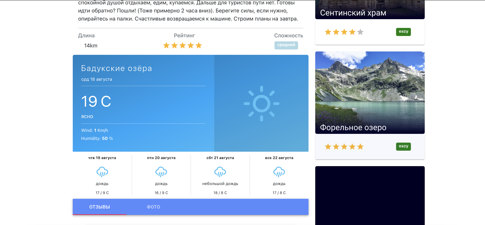
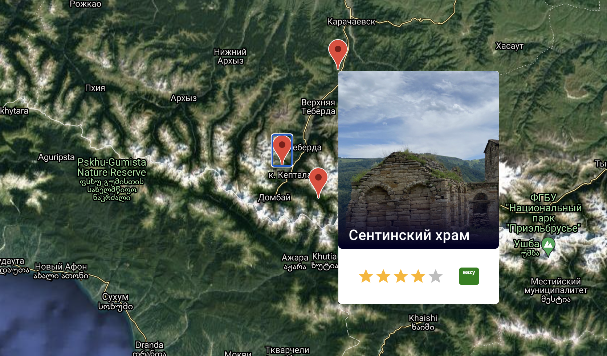

# Pathfinder​  

#### Приложение для поиска походных маршрутов и способов их проходжения.
#### В данном проекте были реализованы функции вывода маршрутов и маркеров с координатами конечной точки маршрута. Добавление кастомных маршрутов с собственным описанием, координатами цели и остальными данными с возможностью их изменения.
#### Регистрация и авторизация пользователя, а также его редактирование профиля. На странице карточки с маршрутом запрашивается погода по координатам выбранного маршрута. Функционал комментариев также реализован.

-----------

[Главная страница](./server/public/stylesheets/screenshot0.png)  
  

[Карточка маршрута](./server/public/stylesheets/screenshot1.png)
  

[Превью маршрута на встроенных Google Maps API](./server/public/stylesheets/screenshot2.png)
  


-----------

```

Запуск сервера и засеивание базы:
/server
npm i 
npx sequelize db:migrate
npx sequelize db:seed:all

Запуск приложения и засеивание базы:
/client
npm i 
npm start
